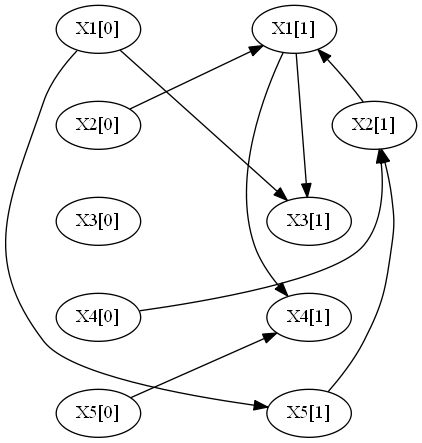
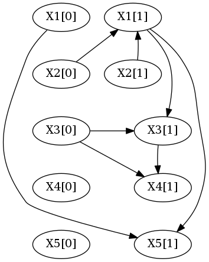
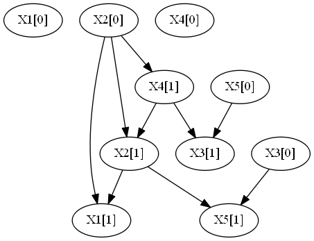

# Program description

learnDBN is Java implementation of a Dynamic Bayesian Network (DBN) structure learning algorithm. It can learn tDBN, cDBN and bcDBN structures from a file with multivariate longitudinal observations. Also, it improves these algorithms by allowing the data to have missing values. As such this implementation can impute missing values. Moreover, it has the capability of learning a Dynamic Bayesian Multinet (DBM) which is an extension of a Bayesian Multinet. By using the DBM model this implementation has the capability of performing clustering on the data.

# Current release

Because this implimentation has two different objective there is two different programs.

*   The learnDBN that learns DBNs from data with missing values and then impute that values, can be downloaded here. 
*   The learnDBM that learns a DBM from the data and then outputs the clustering result, can be downloaded here.

All of these programs comes packaged as an executable JAR file, already including the required external libraries.


# Usage

## learnDBN
By executing the jar file ...

```shell
$ java -jar learnDBN.jar 
```
... the available command-line options are shown:

```
usage: learnDBN
 -bcDBN,--bcDBN               Learns a bcDBN structure.
 -c,--compact                 Outputs network in compact format, omitting
                              intra-slice edges. Only works if specified
                              together with -d and with --markovLag 1.
 -cDBN,--cDBN                 Learns a cDBN structure.
 -d,--dotFormat               Outputs network in dot format, allowing
                              direct redirection into Graphviz to
                              visualize the graph.
 -i,--file <file>             Input CSV file to be used for network
                              learning.
 -imp,--impute                If the file has missing values impute these
                              values. The resulting data with imputed
                              values is saved in the same folder with
                              <filename>_imputed.csv
 -ind,--intra_in <int>        In-degree of the intra-slice network
 -m,--markovLag <int>         Maximum Markov lag to be considered, which
                              is the longest distance between connected
                              time-slices. Default is 1, allowing edges
                              from one preceding slice.
 -mt,--MultiThread            Learns the DBN using parallel computations.
 -ns,--nonStationary          Learns a non-stationary network (one
                              transition network per time transition). By
                              default, a stationary DBN is learnt.
 -o,--outputFile <file>       Writes output to <file>. If not supplied,
                              output is written to terminal.
 -p,--numParents <int>        Maximum number of parents from preceding
                              time-slice(s).
 -pm,--parameters             Learns and outputs the network parameters.
 -r,--root <int>              Root node of the intra-slice tree. By
                              default, root is arbitrary.
 -s,--scoringFunction <arg>   Scoring function to be used, either MDL or
                              LL. MDL is used by default.
 -sp,--spanning               Forces intra-slice connectivity to be a tree
                              instead of a forest, eventually producing a
                              structure with a lower score.
```


## learnDBM
By executing the jar file ...

```shell
$ java -jar learnDBM.jar 
```
... the available command-line options are shown:

```
usage: learnDBM
 -bcDBN,--bcDBN               Learns a bcDBN structure.
 -c,--compact                 Outputs network in compact format, omitting
                              intra-slice edges. Only works if specified
                              together with -d and with --markovLag 1.
 -cDBN,--cDBN                 Learns a cDBN structure.
 -d,--dotFormat               Outputs network in dot format, allowing
                              direct redirection into Graphviz to
                              visualize the graph.
 -i,--file <file>             Input CSV file to be used for network
                              learning.
 -ind,--intra_in <int>        In-degree of the intra-slice network
 -k,--numClusters <int>       Number of cluster in data.
 -m,--markovLag <int>         Maximum Markov lag to be considered, which
                              is the longest distance between connected
                              time-slices. Default is 1, allowing edges
                              from one preceding slice.
 -mt,--MultiThread            Learns the DBN using parallel computations.
 -ns,--nonStationary          Learns a non-stationary network (one
                              transition network per time transition). By
                              default, a stationary DBN is learnt.
 -o,--outputFile <file>       Writes output to <file>. If not supplied,
                              output is written to terminal.
 -p,--numParents <int>        Maximum number of parents from preceding
                              time-slice(s). The default values is 1.
 -pm,--parameters             Learns and outputs the network parameters.
 -r,--root <int>              Root node of the intra-slice tree. By
                              default, root is arbitrary.
 -s,--scoringFunction <arg>   Scoring function to be used, either MDL or
                              LL. MDL is used by default.
 -sp,--spanning               Forces intra-slice connectivity to be a tree
                              instead of a forest, eventually producing a
                              structure with a lower score.
```


# Input file format

The input file should be in comma-separated values (CSV) format.

*   The first line is the header, naming the attributes and specifying the time slice index, separared by two underscores: "attributeName__t"
*   The order of the attributes must be maintained: "X1__1", "X2__1", "X1__2", "X2__2".
*   The first column contains an identification (string or number) of each subject (this identifier does not affect the learnt network).
*   All other lines correspond to observations of an individual over time.
*   Missing values can be marked as "?" but should not occur, as the algorithm discards the observation (time slice) in question.

A very simplistic input file example is the following:

```
"subject_id","X1__0","X2__0","X3__0","X1__1","X2__1","X3__1","X1__2","X2__2","X3__2"
"6","7.0","40.0","5.0","7.0","20.0","5.0","4.0","20.0","5.0"
"7","4.0","40.0","5.0","7.0","40.0","5.0","7.0","40.0","5.0"
"8","7.0","20.0","5.0","7.0","40.0","5.0","4.0","20.0","9.0"
"9","7.0","40.0","9.0","7.0","20.0","5.0","7.0","40.0","?"
"10","7.0","20.0","5.0","4.0","20.0","9.0","7.0","20.0","9.0"
"11","?","20.0","5.0","?","20.0","5.0","4.0","20.0","9.0"
"12","4.0","20.0","5.0","7.0","20.0","5.0","4.0","20.0","9.0"
```
# Examples 

## Example #1

The first example considers a synthetic network structure with 5 attributes, each one taking 4 states and one parent from the preceding slice ([t] denotes the time slice):



The above network was sample to produce the following file:
*   [exmp1.csv](./exmp1.csv), with 1000 observations with 5 time steps, 20% of missing values, 20% of observations with missing values

As all nodes have exactly one parent from the past, the best options are to limit the number of parents with -p 1.

The command to learn the network and impute the missing values is:
```shell
java -jar learnDBN.jar -i exmp1.csv -p 1 -imp -mt
```

which produces the following output:
```
Evaluating network with MDL score.
Found missing values in data.
Parameter EM step: 1 score: -32184.7968939429
Parameter EM step: 2 score: -32116.81895576152
Parameter EM step: 3 score: -32115.385956588492
Parameter EM step: 4 score: -32115.342586060127
Parameter EM step: 5 score: -32115.34083770815
Parameter EM step: 6 score: -32115.340752037384
Parameter EM step: 7 score: -32115.34074725887
Parameter EM step: 8 score: -32115.3407469682
Parameter EM step: 9 score: -32115.340746949463
Parameter EM step: 10 score: -32115.3407469482
Parameter EM step: 11 score: -32115.340746948117
Parameter EM step: 12 score: -32115.340746948106
Parameter EM step: 13 score: -32115.340746948103
Parameter EM step: 14 score: -32115.340746948103
Strutural EM step: 1
Parameter EM step: 1 score: -27336.936378385602
Parameter EM step: 2 score: -27015.449042522705
Parameter EM step: 3 score: -27009.25438525708
Parameter EM step: 4 score: -27009.088509908135
Parameter EM step: 5 score: -27009.082936546387
Parameter EM step: 6 score: -27009.082723151798
Parameter EM step: 7 score: -27009.08271432131
Parameter EM step: 8 score: -27009.082713937845
Parameter EM step: 9 score: -27009.082713920747
Parameter EM step: 10 score: -27009.082713919976
Parameter EM step: 11 score: -27009.082713919954
Parameter EM step: 12 score: -27009.082713919946
Parameter EM step: 13 score: -27009.082713919946
Strutural EM step: 2

-----------------

X2[0] -> X1[1]
X4[0] -> X2[1]
X1[0] -> X3[1]
X5[0] -> X4[1]
X1[0] -> X5[1]

X2[1] -> X1[1]
X5[1] -> X2[1]
X1[1] -> X3[1]
X1[1] -> X4[1]
```

Activating the -d switch to directly output in dot format, in order to this functionality to work you need to install [Graphviz](http://www.graphviz.org/) in the following directory:
*   **Windows**: C:\Program Files (x86)\Graphviz2.38
*   **Mac**: /usr/local/bin/dot
*   **Linux**: /usr/bin/dot

However you can change this directory by editing the GraphViz.java file and then compile the program.

So running the following command:
´´´shell
java -jar learnDBN.jar -i exmp1.csv -p 1 -imp -mt -d 
´´´

Produces the imputed file [exmp1_imputed](./exmp1_imputed.csv) and the following graph:



## Example 2
This example consideres a synthetic dataset generated by 2 DBNs with 5 attributes and 10 time steps.
DBN 1            |  DBN 2
:-------------------------:|:-------------------------:
  |  


Text can be **bold**, _italic_, or ~~strikethrough~~.

[Link to another page](./another-page.html).

There should be whitespace between paragraphs.

There should be whitespace between paragraphs. We recommend including a README, or a file with information about your project.

# Header 1

This is a normal paragraph following a header. GitHub is a code hosting platform for version control and collaboration. It lets you and others work together on projects from anywhere.

## Header 2

> This is a blockquote following a header.
>
> When something is important enough, you do it even if the odds are not in your favor.

### Header 3

```js
// Javascript code with syntax highlighting.
var fun = function lang(l) {
  dateformat.i18n = require('./lang/' + l)
  return true;
}
```

```ruby
# Ruby code with syntax highlighting
GitHubPages::Dependencies.gems.each do |gem, version|
  s.add_dependency(gem, "= #{version}")
end
```

#### Header 4

*   This is an unordered list following a header.
*   This is an unordered list following a header.
*   This is an unordered list following a header.

##### Header 5

1.  This is an ordered list following a header.
2.  This is an ordered list following a header.
3.  This is an ordered list following a header.

###### Header 6

| head1        | head two          | three |
|:-------------|:------------------|:------|
| ok           | good swedish fish | nice  |
| out of stock | good and plenty   | nice  |
| ok           | good `oreos`      | hmm   |
| ok           | good `zoute` drop | yumm  |

### There's a horizontal rule below this.

* * *

### Here is an unordered list:

*   Item foo
*   Item bar
*   Item baz
*   Item zip

### And an ordered list:

1.  Item one
1.  Item two
1.  Item three
1.  Item four

### And a nested list:

- level 1 item
  - level 2 item
  - level 2 item
    - level 3 item
    - level 3 item
- level 1 item
  - level 2 item
  - level 2 item
  - level 2 item
- level 1 item
  - level 2 item
  - level 2 item
- level 1 item

### Small image


### Large image


### Definition lists can be used with HTML syntax.

<dl>
<dt>Name</dt>
<dd>Godzilla</dd>
<dt>Born</dt>
<dd>1952</dd>
<dt>Birthplace</dt>
<dd>Japan</dd>
<dt>Color</dt>
<dd>Green</dd>
</dl>

```
Long, single-line code blocks should not wrap. They should horizontally scroll if they are too long. This line should be long enough to demonstrate this.
```

```
The final element.
```
